# DataISource — Backend Platform Take-Home


A supplier-intelligence backend platform for manufacturing RFQ (Request for Quotation) document analysis. It demonstrates three communication patterns — **REST**, **WebSocket**, and **background polling** — on a single async Python stack.

---

## Table of Contents

- [Overview](#overview)
- [Getting Started](#getting-started)
- [Features](#features)
- [Architecture](#architecture)
- [Tech Stack](#tech-stack)
- [API Reference](#api-reference)
- [Project Structure](#project-structure)
- [Design Decisions](#design-decisions)
- [Documentation](#documentation)
- [Screenshots](#screenshots)

---

## Overview

DataISource ingests plain-text manufacturing documents (RFQs, technical specs), extracts structured entities via rule-based NLP, and monitors global news for supply-chain disruptions using the GDELT API. Clients receive real-time push updates over WebSocket as each stage completes.

```
Client ──POST /documents──► FastAPI ──► ExtractionService ──► SQLite
                                │                                  │
                                ▼                                  ▼
                          EventBus ──► WebSocket Manager ──► Client WS
                                │
                          PollScheduler ──► GDELTService ──► AlertEvents ──► Client WS
```

---

## Getting Started

```bash
cp sample.env .env
docker compose -f docker-compose.yml up --build
```

- SPA: `http://localhost:8800/index.html`
- Swagger UI: `http://localhost:8800/docs`

Full setup instructions, environment variables, test commands, and demo walkthrough → **[docs/local-run-and-testing.md](docs/local-run-and-testing.md)**

---

## Features

### 1. Document Ingestion & NLP Extraction


- **Upload** plain-text manufacturing documents via `POST /api/v1/documents`
- **Deduplication** by SHA-256 hash — re-uploading the same file returns `409 Conflict`
- **Document type detection** — classifies as `rfq`, `specification`, or `document`
- **Keyword extraction** — from "Keywords Of Interest" sections or pattern matching
- **Entity extraction** — material grades, quantities, units, tolerances, certifications, incoterms
- **Confidence scoring** — weighted combination of pattern match, validation, and context signals
- **Real-time progress** — WebSocket events fired at each stage (`document.started`, `document.completed`, `document.failed`)

→ Full pipeline details in **[docs/data-extraction.md](docs/data-extraction.md)**

### 2. Real-Time WebSocket Notifications


- Connect to `/api/v1/ws/events` (all channels) or `/api/v1/ws/events/{channel}`
- Four channels: `documents`, `alerts`, `records`, `all`
- Invalid channel name closes connection with code `4001`
- Every broadcast is persisted to `websocket_messages` audit table

### 3. GDELT News Monitoring


Background polling of the GDELT API for supply-chain disruption signals, with deduplication, retry/backoff, and real-time WebSocket push.

→ Full poll cycle details in **[docs/gdelt-monitoring.md](docs/gdelt-monitoring.md)**

### 4. Database Explorer


- `GET /api/v1/tables` — list all tables with row counts
- `GET /api/v1/tables/{table_name}` — paginated rows
- `DELETE /api/v1/tables/{table_name}` — clear a table
- `DELETE /api/v1/tables/{table_name}/{row_id}` — delete one row

---

## Architecture

### Layered Design

```
┌──────────────────────────────────────────────────┐
│                  HTTP / WebSocket                │
│              (FastAPI routes + ASGI)             │
├──────────────────────────────────────────────────┤
│              API Layer  (api/v1/)                │
│   endpoints/  │  models/  │  ws/                 │
├──────────────────────────────────────────────────┤
│             Service Layer  (services/)           │
│  DocumentService │ ExtractionService │ GdeltSvc  │
│  PollService     │ AlertService      │ EventBus  │
├──────────────────────────────────────────────────┤
│           Repository Layer  (db/repositories/)   │
│  DocumentRepo │ AlertRepo │ PollRepo │ WsAudit   │
├──────────────────────────────────────────────────┤
│         Persistence  (SQLite + aiosqlite)        │
│   SQLAlchemy 2.0 async ORM │ WAL mode enabled    │
└──────────────────────────────────────────────────┘
```

### Event-Driven Communication

```
DocumentService ─── publish("document.completed") ──►┐
AlertService    ─── publish("alert.detected")  ──────►│ EventBus
PollService     ─── publish("poll.completed")  ──────►│ (in-process pub/sub)
                                                      │
                    ◄── subscribe(channel) ───────────┘
                    │
              WsConnectionManager
                    │
              ┌─────┴──────────────┐
              │  per-client WS     │  WsMessageRepository
              │  send_json(event)  │  (audit log every broadcast)
              └────────────────────┘
```

### Background Worker Flow

```
Scheduler (asyncio) ─── every POLL_INTERVAL_SECONDS ──►┐
                                                        │
                                                 PollService
                                                        │
                                         ┌──────────────┴──────────────┐
                                         │  sample 3 monitor topics    │
                                         │  fetch GDELT concurrently   │
                                         │  (semaphore + stagger)      │
                                         │  deduplicate by URL         │
                                         │  insert AlertEvents         │
                                         │  publish to EventBus        │
                                         └─────────────────────────────┘
```

---

## Tech Stack

### Backend

| Layer | Technology | Badge |
|-------|-----------|-------|
| Framework | FastAPI 0.116 + Uvicorn 0.35 |  |
| Language | Python 3.13 |  |
| Database | SQLite 3 + aiosqlite 0.20 |  |
| ORM | SQLAlchemy 2.0 (async) |  |
| Validation | Pydantic v2 + pydantic-settings |  |
| NLP | spaCy 3.7 (blank tokenizer) |  |
| HTTP Client | httpx 0.28 (async) |  |
| WebSocket | Starlette WebSocket (via FastAPI) |  |
| File Upload | python-multipart 0.0.20 |  |
| Scheduling | asyncio-based scheduler |  |

### Frontend

| Layer | Technology | Badge |
|-------|-----------|-------|
| UI Framework | Bootstrap 5 (CDN) |  |
| JavaScript | Vanilla ES6 modules |  |
| Build | None (zero-build static) |  |
| WebSocket | Browser native API |  |

### Testing & DevOps

| Tool | Version | Badge |
|------|---------|-------|
| pytest | 8.3 |  |
| pytest-asyncio | auto mode |  |
| Docker | python:3.13-slim |  |
| docker-compose | v2 |  |

---

## API Reference

Base path: `/api/v1`

### Health

| Method | Path | Status | Description |
|--------|------|--------|-------------|
| `GET` | `/health` | `200` | Liveness + readiness probe (checks DB) |

**Response:**
```json
{
  "status": "ok",
  "database": {
    "connected": true,
    "path": "/app/data/DataISource-takehome.sqlite3"
  }
}
```

### Documents

| Method | Path | Status | Description |
|--------|------|--------|-------------|
| `GET` | `/documents` | `200` | List all documents (newest first) |
| `POST` | `/documents` | `201` | Upload file for extraction (multipart) |
| `GET` | `/documents/{id}` | `200` | Fetch single document |
| `DELETE` | `/documents/{id}` | `204` | Delete document + cascaded keywords/entities |
| `GET` | `/documents/{id}/keywords` | `200` | Extracted keywords |
| `GET` | `/documents/{id}/entities` | `200` | Extracted entities |

**Upload validation rules:**

| Rule | HTTP Status |
|------|------------|
| Duplicate file (same SHA-256) | `409 Conflict` |
| Empty file | `422 Unprocessable Entity` |
| Whitespace-only content | `422 Unprocessable Entity` |
| Unsupported MIME type (non-`text/*`) | `415 Unsupported Media Type` |
| Non-UTF-8 encoding | `422 Unprocessable Entity` |
| File exceeds 10 MB | `422 Unprocessable Entity` |
| Path traversal in filename | `422 Unprocessable Entity` |
| Filename exceeds 255 chars | `422 Unprocessable Entity` |

**Upload response example:**
```json
{
  "id": "3fa85f64-5717-4562-b3fc-2c963f66afa6",
  "source_filename": "rfq_001.txt",
  "document_type": "rfq",
  "processing_status": "processed",
  "created_at": "2024-01-15T10:30:00Z",
  "processed_at": "2024-01-15T10:30:01Z"
}
```

### News & Alerts

| Method | Path | Status | Description |
|--------|------|--------|-------------|
| `POST` | `/news/poll` | `201` | Trigger one-shot GDELT polling cycle |
| `GET` | `/news/alerts` | `200` | List all stored alert events |
| `GET` | `/news/alerts/{id}` | `200` | Fetch single alert |
| `DELETE` | `/news/alerts` | `204` | Delete all alerts |

### Database Explorer

| Method | Path | Status | Description |
|--------|------|--------|-------------|
| `GET` | `/tables` | `200` | List all tables with row counts |
| `GET` | `/tables/{name}` | `200` | Paginated rows (`?page=1&page_size=50`) |
| `DELETE` | `/tables/{name}` | `204` | Clear all rows in a table |
| `DELETE` | `/tables/{name}/{row_id}` | `204` | Delete one row |

### WebSocket

| Endpoint | Description |
|----------|-------------|
| `WS /api/v1/ws/events` | Subscribe to all channels |
| `WS /api/v1/ws/events/{channel}` | Subscribe to one channel (`documents`, `alerts`, `records`, `all`) |

Close code `4001` is sent for unknown channel names.

**Event envelope:**
```json
{
  "channel": "documents",
  "event": "document.completed",
  "correlation_id": "abc-123",
  "timestamp": "2024-01-15T10:30:01Z",
  "data": { ... }
}
```

| Channel | Events |
|---------|--------|
| `documents` | `document.started`, `document.completed`, `document.failed`, `document.deleted` |
| `alerts` | `alert.detected`, `alert.notified` |
| `records` | `record.created` |
| `all` | All of the above |

---

## Project Structure

```
/  (repository root)
├── server.py                 ← FastAPI app factory + lifespan
├── settings.py               ← Pydantic BaseSettings (env-driven config)
├── logger.py                 ← structured logging setup
├── ui.py                     ← static file / partial serving
├── .env                      ← runtime environment variables
├── Dockerfile                ← container definition
├── docker-compose.yml        ← local orchestration
├── requirements.txt          ← pinned Python dependencies
├── pytest.ini                ← asyncio_mode = auto, testpaths = tests
│
├── api/v1/
│   ├── endpoints/
│   │   ├── documents.py      ← upload, list, get, delete, keywords, entities
│   │   ├── news.py           ← poll trigger, alert list/get/delete
│   │   ├── tables.py         ← database explorer endpoints
│   │   ├── health.py         ← liveness + readiness probe
│   │   └── websocket.py      ← WS upgrade handler
│   ├── models/
│   │   ├── request_models.py ← Pydantic request schemas
│   │   └── response_models.py← Pydantic response schemas
│   └── ws/
│       └── connection_manager.py ← WebSocket registry + broadcast
│
├── db/
│   ├── database.py           ← async engine, session factory, get_db dependency
│   ├── sqlite/
│   │   ├── base.py           ← SQLAlchemy ORM models
│   │   └── __init__.py       ← WAL mode + FK pragmas
│   └── repositories/
│       ├── document_repository.py
│       ├── alert_repository.py
│       ├── poll_repository.py
│       └── ws_message_repository.py
│
├── services/
│   ├── document_service.py   ← document ingestion orchestration
│   ├── extraction_service.py ← extraction pipeline coordinator
│   ├── extraction_engine.py  ← spaCy rule-based patterns
│   ├── extraction_models.py  ← extraction dataclasses
│   ├── gdelt_service.py      ← GDELT API async client
│   ├── poll_service.py       ← polling orchestration
│   ├── alert_service.py      ← alert CRUD + lifecycle
│   └── event_bus.py          ← in-process async pub/sub
│
├── workers/
│   ├── polling_worker.py     ← poll cycle executor
│   └── scheduler.py          ← asyncio-based scheduler
│
├── static/
│   ├── index.html            ← SPA shell
│   ├── css/                  ← Bootstrap + custom styles
│   ├── js/                   ← ES6 modules (api/, views, utils)
│   └── partials/             ← HTML fragments (dynamically loaded)
│
├── tests/
│   ├── conftest.py           ← async test fixtures, DB isolation
│   ├── test_documents.py     ← 31 document endpoint tests
│   ├── test_health.py        ← health check tests
│   ├── test_news.py          ← alert + polling tests (mocked GDELT)
│   └── test_tables.py        ← database explorer tests
│
├── docs/
│   ├── local-run-and-testing.md
│   ├── data-extraction.md
│   ├── gdelt-monitoring.md
│   ├── aws-governance-and-quality.md
│   ├── diagram-requirements.md
│   └── manufacturing_rfq_sample.txt  ← sample RFQ document
│
└── data/                     ← SQLite DB written here at runtime (gitignored)
    └── DataISource-takehome.sqlite3
```

### Frontend Module Layout

```
static/js/
├── main.js            ← partial loader + view bootstrap
├── index.js           ← entry point + event delegation
├── constants.js       ← shared constants (channels, API paths)
├── utils.js           ← formatting helpers
├── renderers.js       ← DOM builders for tables and cards
├── toast.js           ← notification toasts
├── notifications.js   ← notification management
├── view-switcher.js   ← show/hide partials
├── ws-panel.js        ← live event feed sidebar
├── ws-test.js         ← WebSocket test view
├── home.js            ← dashboard view
├── upload.js          ← upload view
├── news.js            ← news monitor view
├── tables.js          ← DB explorer view
├── api-test.js        ← REST test harness
└── api.js             ← HTTP fetch wrapper + all API calls
```

---

## Design Decisions

| Decision | Choice | Rationale |
|----------|--------|-----------|
| **Database** | SQLite + aiosqlite | Zero setup; WAL mode for concurrent r/w; swap to Postgres = one connection string change |
| **NLP** | Rule-based spaCy (no model) | Manufacturing codes are deterministic patterns; zero download; fully testable offline |
| **Event delivery** | In-process EventBus | Services stay decoupled from WebSocket layer; future consumers (webhooks, email) attach without touching service code |
| **Deduplication** | SHA-256 → unique constraints → savepoint rollback | Each layer catches a different class of duplicate; one failure never aborts the whole run |
| **Concurrency** | Full async (FastAPI / SQLAlchemy / httpx / asyncio) | Single event loop; no blocking I/O; no threading complexity |

---

## Documentation

| Document | Description |
|----------|-------------|
| [local-run-and-testing.md](docs/local-run-and-testing.md) | Docker setup, environment variables, test runner commands, and demo walkthrough |
| [data-extraction.md](docs/data-extraction.md) | NLP pipeline, GDELT extraction, database schema, API usage, and real-time events |
| [gdelt-monitoring.md](docs/gdelt-monitoring.md) | GDELT poll cycle, retry strategy, monitor topics, API details, and WebSocket events |
| [aws-governance-and-quality.md](docs/aws-governance-and-quality.md) | AWS service mapping, WebSocket scaling strategy, data governance, and trade-offs |
| [diagram-requirements.md](docs/diagram-requirements.md) | System architecture, REST, WebSocket, polling, and deployment Mermaid diagrams |
| [manufacturing_rfq_sample.txt](docs/manufacturing_rfq_sample.txt) | Sample RFQ document for testing the extraction pipeline |

---

## Screenshots

### Document Upload & Extraction

| | |
|---|---|
| 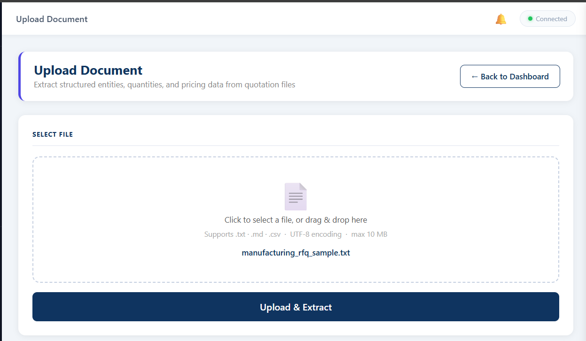 | 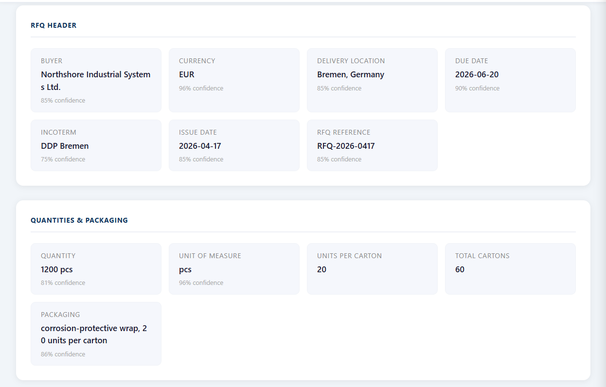 |
| Upload interface | Extraction results |
| 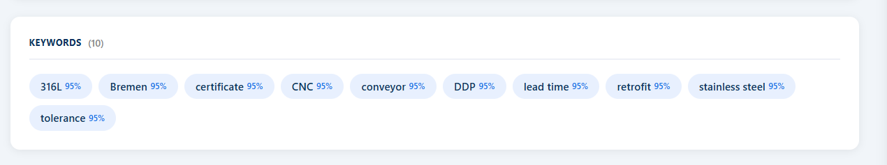 | 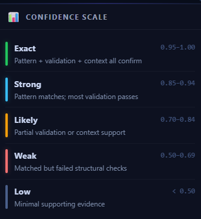 |
| Keywords panel | Confidence scoring |
| 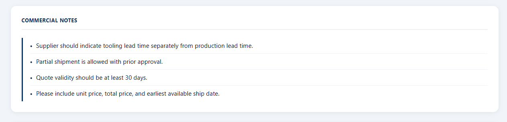 |  |
| Commercial notes | Packaging entities |
| 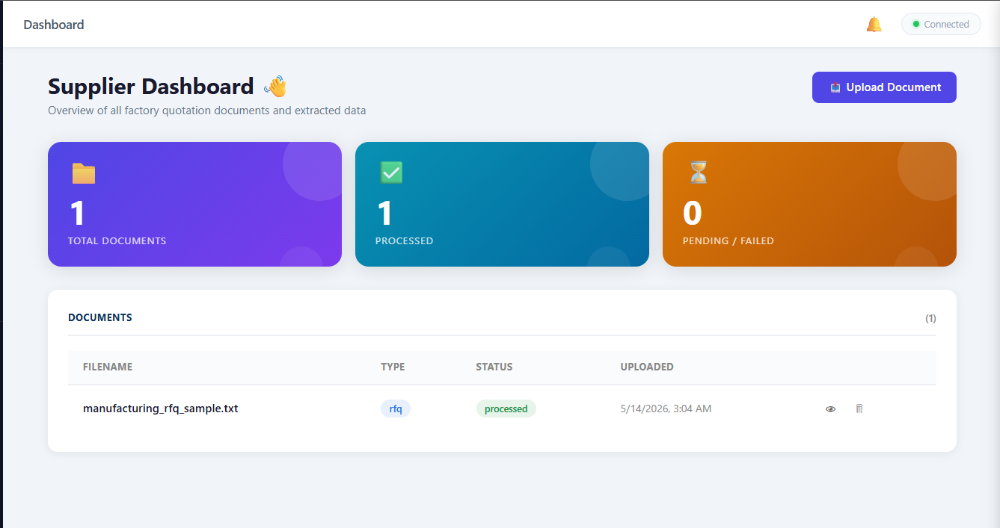 | |
| Document list | |

### WebSocket & Live Events

| | |
|---|---|
| 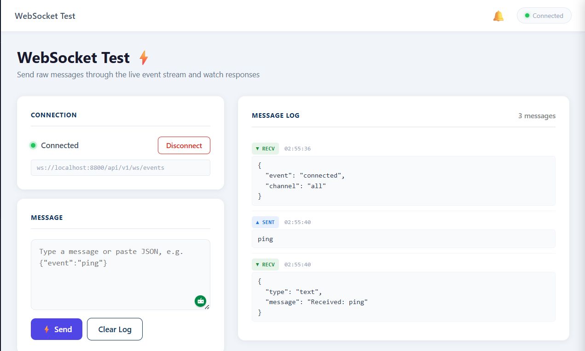 | 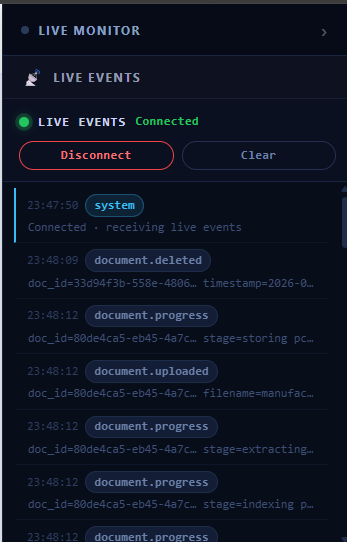 |
| WebSocket test view | Live events panel |

### News Monitor

| | |
|---|---|
| 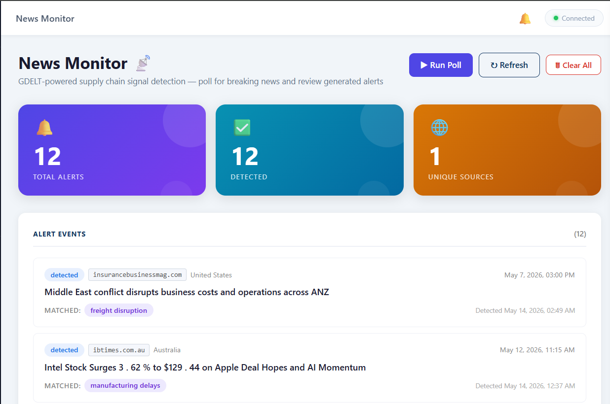 | 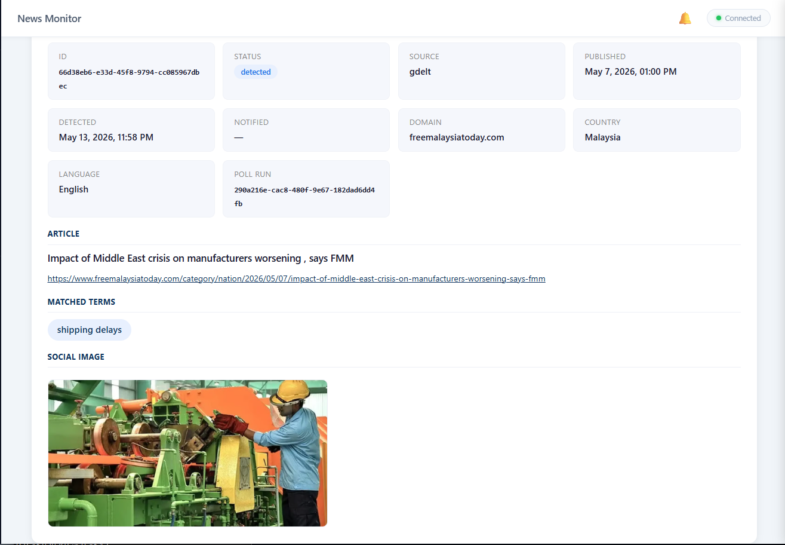 |
| GDELT alerts list | Alert detail |
| 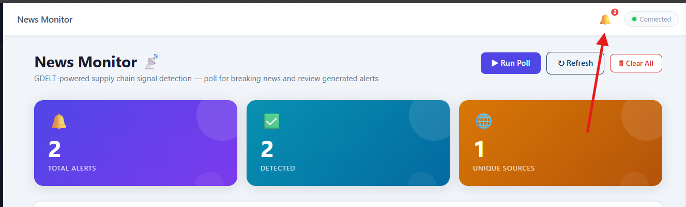 | |
| News notification | |

### Database Explorer

| | |
|---|---|
| 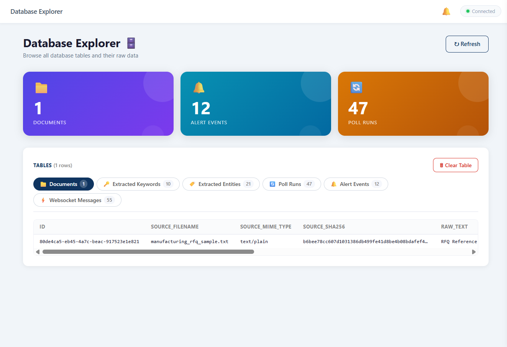 | 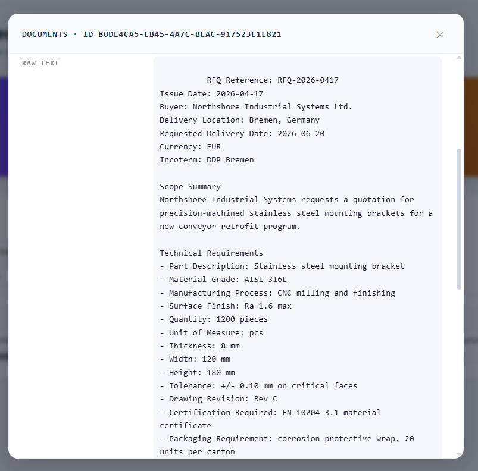 |
| Table browser | Row detail |
| 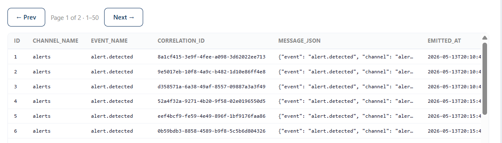 | 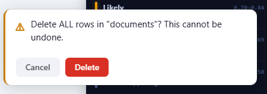 |
| Pagination | Delete confirmation |

### API Testing

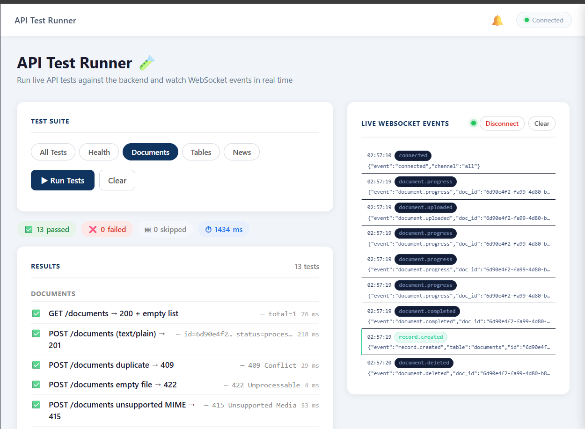

---

*Built for the DataISource backend platform engineering take-home assessment.*

---

## Author

**Esraa Raffik Mashaal**
Senior Software Engineer

📧 [esraa.mashaal96@gmail.com](mailto:esraa.mashaal96@gmail.com)
📱 +20 101 358 9988
🔗 LinkedIn: https://www.linkedin.com/in/esraamashaal/

