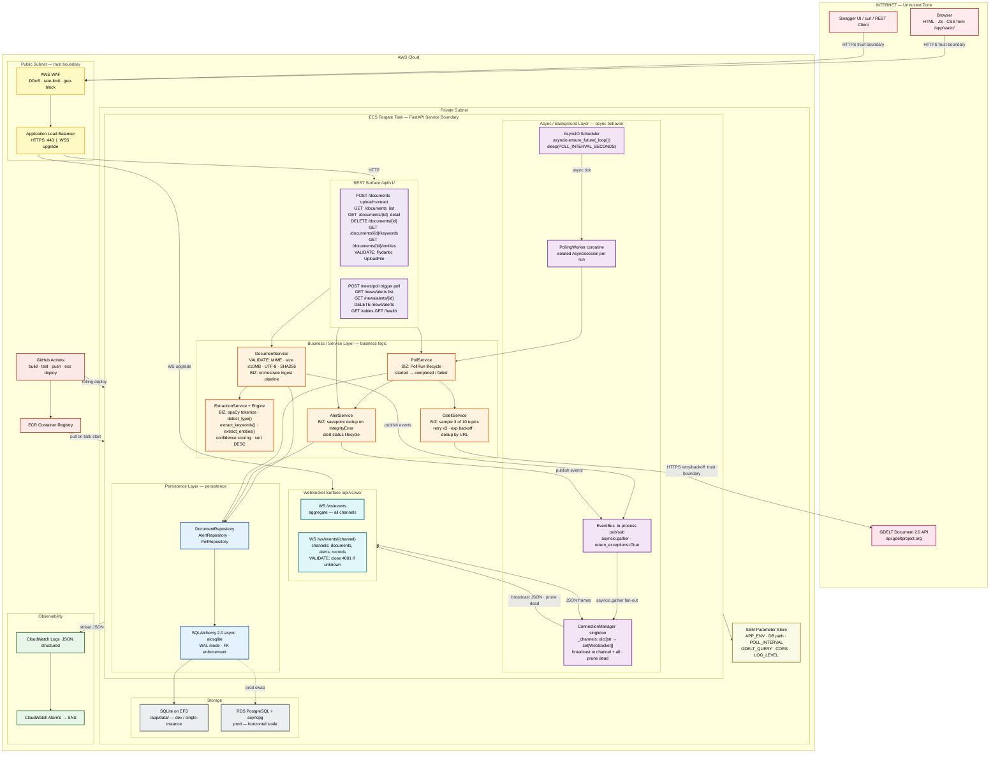
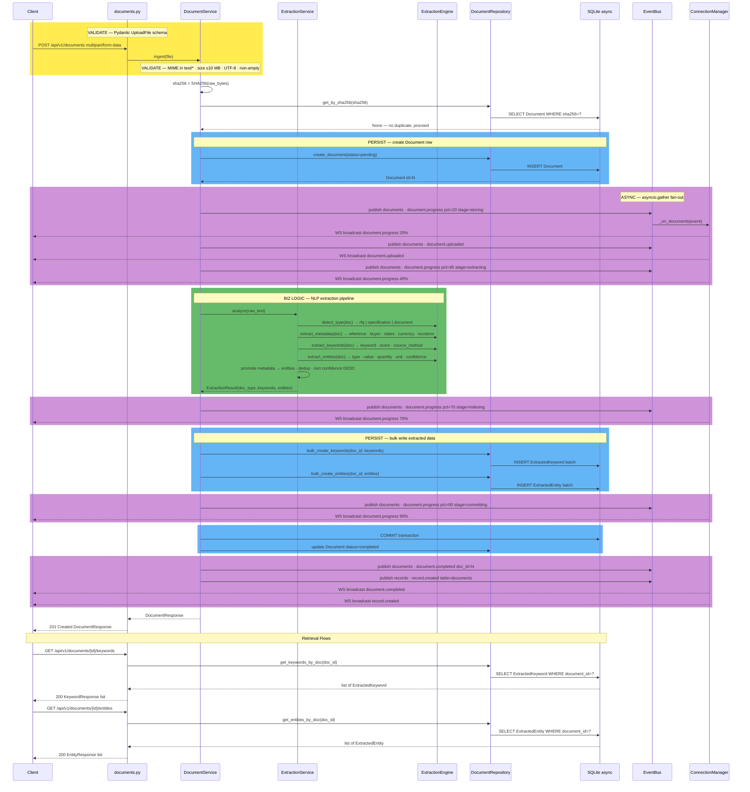
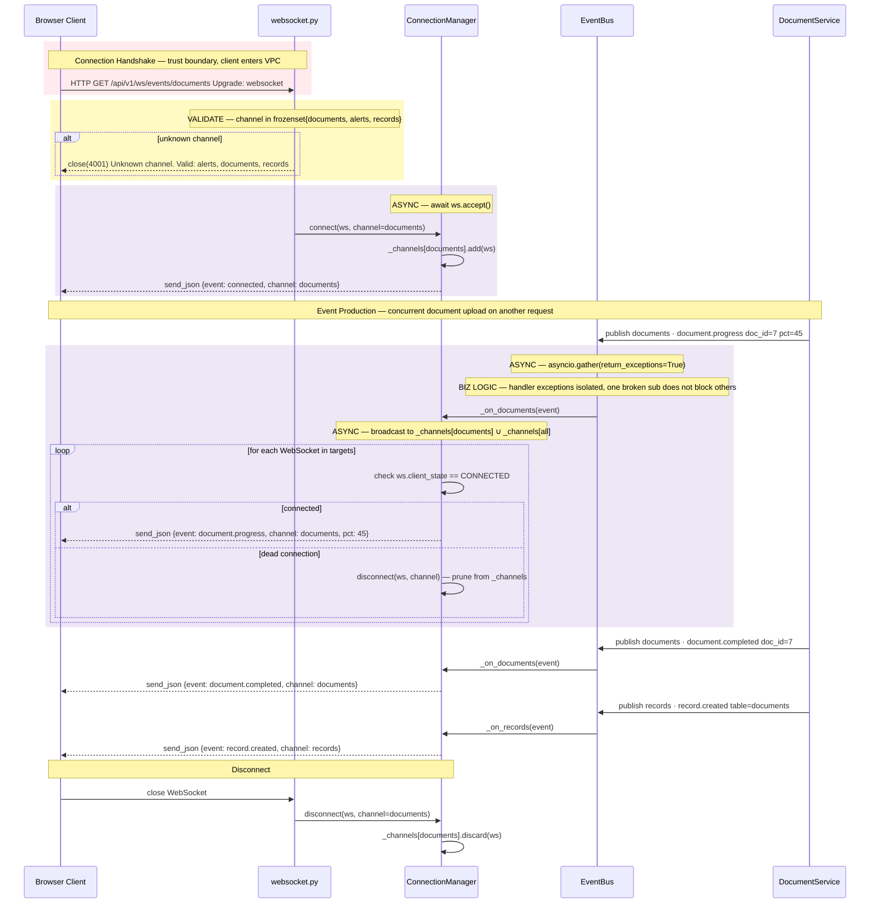
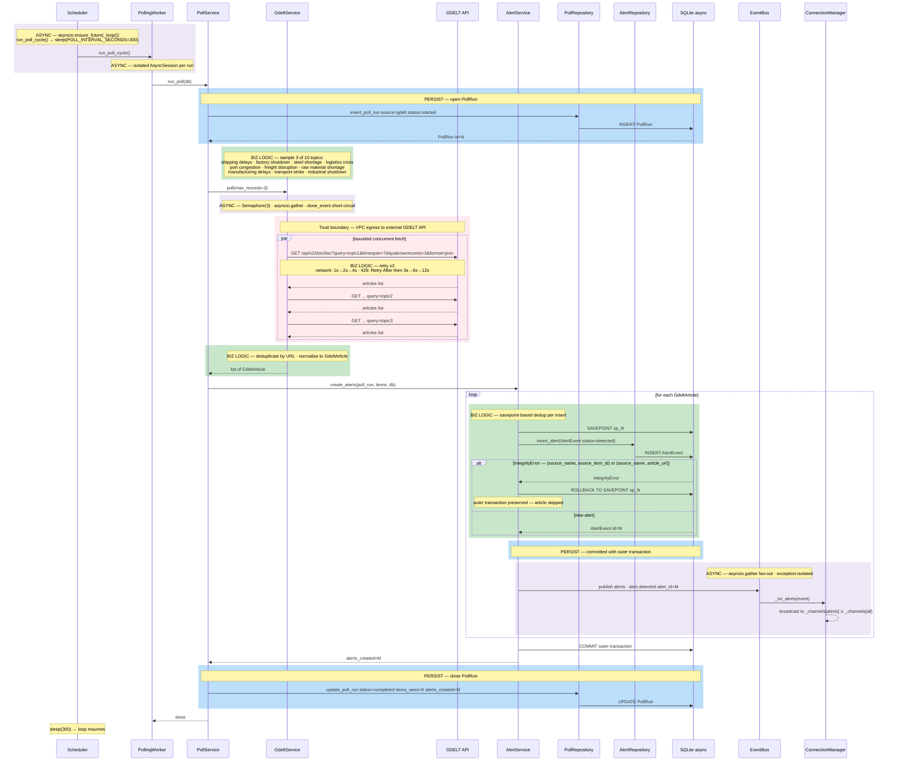
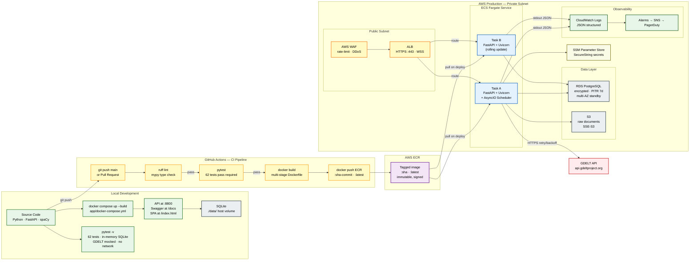

# Diagram And Architecture Requirements

## Legend

| Marker | Color | Meaning |
|---|---|---|
| `VALIDATE` | Yellow | Pydantic schemas, MIME whitelist, size limits, channel gating, SHA256 dedup |
| `BIZ LOGIC` | Green | Extraction pipeline, dedup strategy, retry/backoff, normalisation |
| `PERSIST` | Blue | Write to SQLite via SQLAlchemy async ORM |
| `ASYNC` | Purple | asyncio coroutines, background tasks, `asyncio.gather` fan-out |
| Trust boundary | Red | Connections crossing between untrusted and trusted zones |

---

## 1. System Architecture View

---

## 2. REST Data Flow Zoomed View

---

## 3. WebSocket Data Flow Zoomed View

---

## 4. Polling And Monitoring Data Flow Zoomed View

---

## 5. Architecture to Deployment

