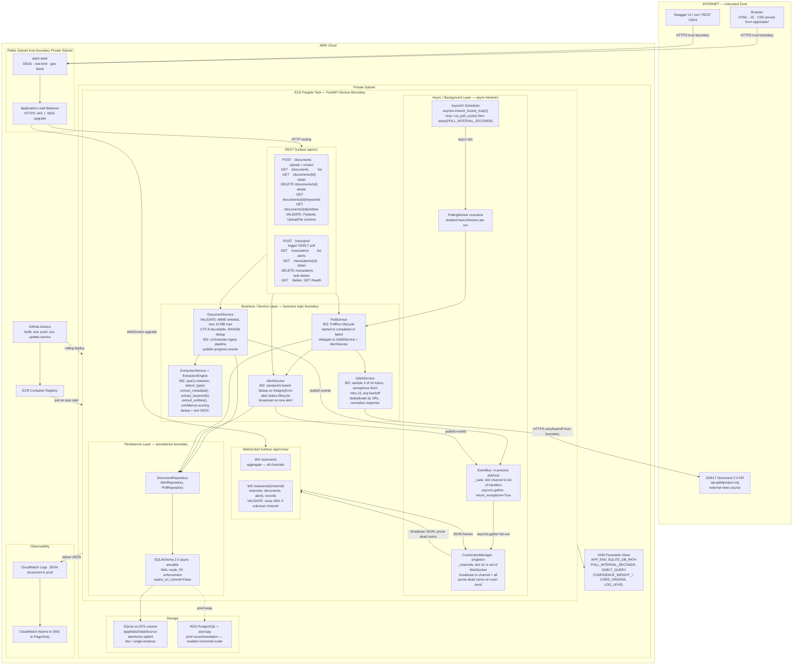
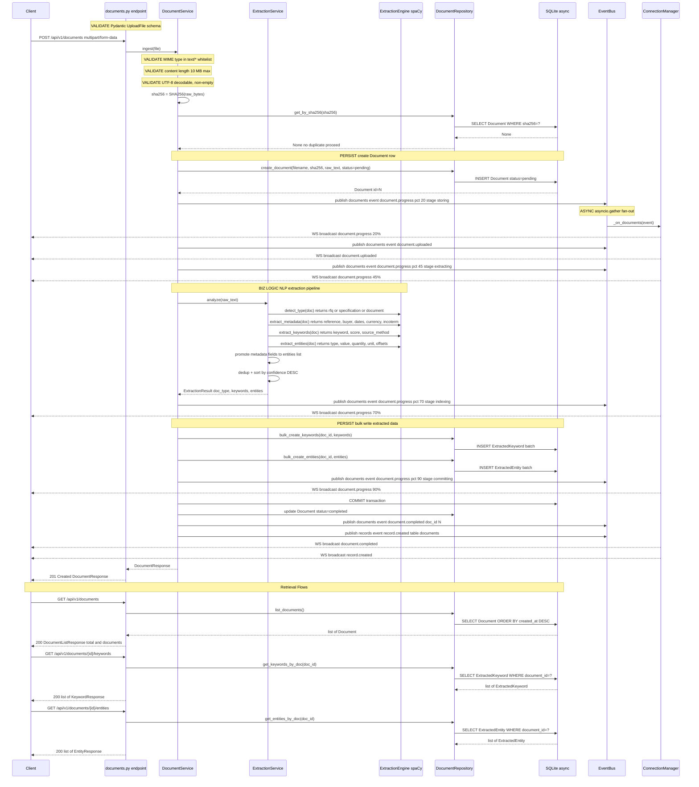
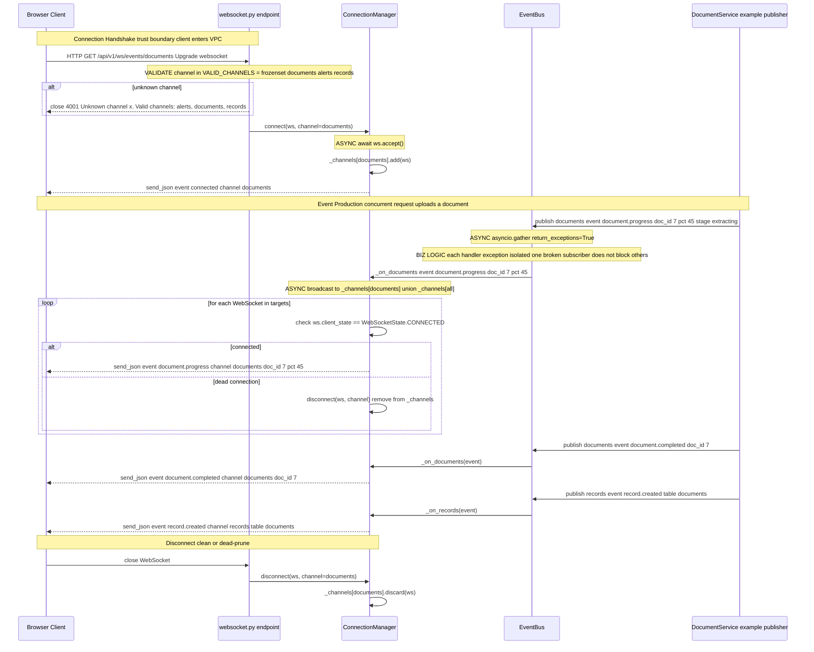
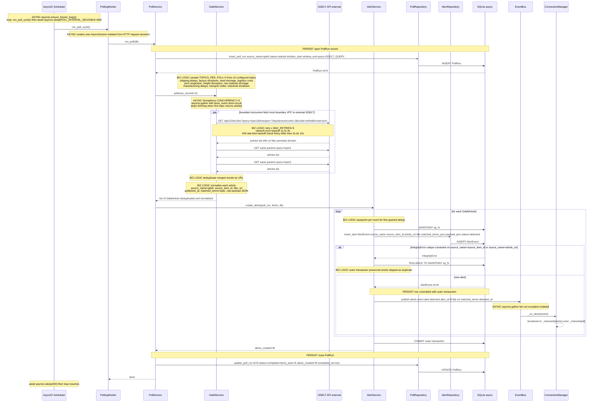

# Diagram And Architecture Requirements

Provide diagrams that explain your implementation and your proposed production direction.

---

## Legend

| Marker | Meaning |
|---|---|
| `VALIDATE` | Input validation — Pydantic schemas, MIME whitelist, size limits, channel gating, SHA256 dedup |
| `BIZ LOGIC` | Business logic — extraction pipeline, dedup strategy, retry/backoff, response normalisation |
| `PERSIST` | Write to SQLite via SQLAlchemy async ORM |
| `ASYNC` | asyncio coroutines, background tasks, `asyncio.gather` fan-out |
| Trust boundary | Annotated on connections that cross between untrusted and trusted zones |

---

## 1. System Architecture View

Shows all runtime components: client entry points, AWS services, FastAPI service boundary,
REST surface, WebSocket surface, polling worker, DB storage, background async handling,
and the external GDELT news source. Trust boundaries are marked on every cross-zone connection.

---

## 2. REST Data Flow Zoomed View

End-to-end flow for document upload, extraction, persistence, and retrieval.
Annotations mark exactly where validation, business logic, and persistence occur.

---

## 3. WebSocket Data Flow Zoomed View

Shows how a local client connects, how channel validation enforces the trust boundary,
how events are produced by services and delivered through EventBus to ConnectionManager to clients,
and how dead connections are pruned automatically.

---

## 4. Polling And Monitoring Data Flow Zoomed View

Shows how GDELT data is queried, normalised, stored, deduplicated,
and turned into alert events with real-time WebSocket delivery.

